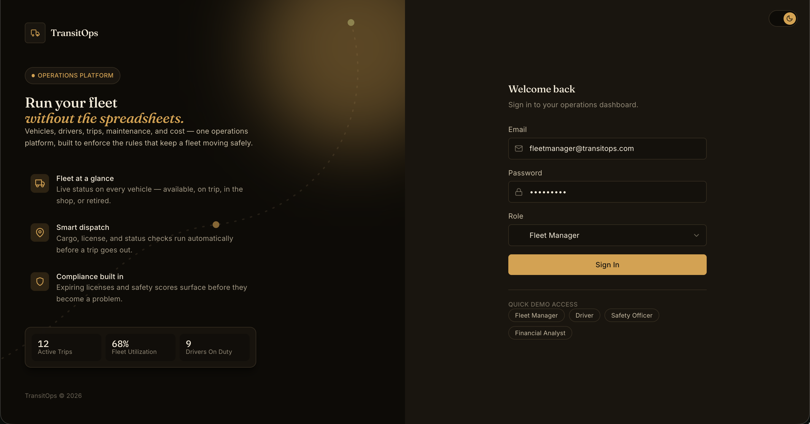
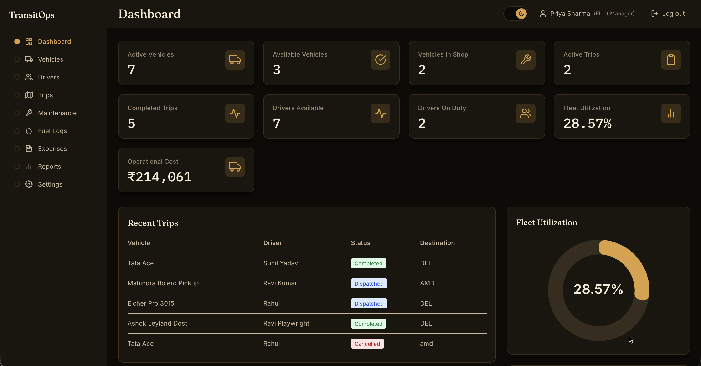

# TransitOps

Fleet management platform for coordinating vehicles, drivers, trips, maintenance, fuel, expenses, and costs — with role-based access control (RBAC).

Built for the **odoo** hackathon brief — an 8-hour build to digitize the vehicle/driver/dispatch/maintenance/expense workflow that logistics teams otherwise run on spreadsheets and paper logbooks.

## Tech Stack

- **Client**: React + TypeScript, Vite, Tailwind CSS
- **Server**: Node.js, Express, MongoDB (Mongoose)
- **Auth**: JWT (httpOnly cookie), role-based login

## Features

### Core deliverables (from the brief)

| Spec requirement | Status |
|---|---|
| Responsive web interface | ✅ |
| Authentication with RBAC | ✅ JWT + role selection at login |
| CRUD for Vehicles and Drivers | ✅ |
| Trip Management with validations | ✅ cargo weight vs. capacity, driver/vehicle availability, license validity |
| Automatic status transitions | ✅ dispatch/complete/cancel flips vehicle + driver status; maintenance flips vehicle to "In Shop" |
| Maintenance workflow | ✅ |
| Fuel & Expense tracking | ✅ combined with maintenance costs into running per-vehicle totals |
| Dashboard with KPIs | ✅ active/available vehicles, trips, drivers on duty, fleet utilization |

Business rules enforced (not just hinted at in the UI):
- Vehicle registration numbers are unique
- Retired / In Shop vehicles never appear in the dispatch pool
- Drivers with expired licenses or Suspended status can't be assigned to trips
- A vehicle or driver already On Trip can't be double-booked
- Cargo weight is checked against the vehicle's max load capacity
- Dispatch/Complete/Cancel automatically updates vehicle + driver status
- Opening a maintenance record auto-sets the vehicle to In Shop; closing it restores Available (unless retired)

### Bonus features (from the brief)

| Bonus feature | Status |
|---|---|
| Charts and visual analytics | ✅ fleet utilization + vehicle status charts |
| PDF export | ✅ |
| Search, filters, and sorting | ✅ across Vehicles, Drivers, Trips, Maintenance, Expenses |
| Dark mode | ✅ full light/warm-dark theme toggle, persisted per user |
| SMS Notifications | ✅ |

> CSV export is also implemented — it's specified in the brief's Reports & Analytics functional requirement (3.8), not in either checklist above, so it isn't a "bonus" so much as a base requirement that happens to live outside these two lists.

### Sample Images





### Beyond the brief

A few things we added that weren't asked for but rounded out the platform:
- Adding a driver also creates their login credentials, linked to their driver record
- Settings page: Fleet Manager can toggle which sidebar tabs are visible per role

## Project Structure

```
TransitOps/
├── client/     # React + Vite frontend
└── server/     # Express + MongoDB backend
```

## Setup

### 1. Install dependencies

```bash
cd server && npm install
cd ../client && npm install
```

### 2. Configure environment

Copy `server/.env.example` to `server/.env` and fill in:

```
MONGO_URI=<your MongoDB connection string>
JWT_SECRET=<a long random string>
JWT_EXPIRES_IN=7d
PORT=8000
CLIENT_URL=http://localhost:5173
```

### 3. Seed the database (first run only)

```bash
cd server && node seed/seed.js
```

Creates one user per role, all with password `Passw0rd!`:

| Role | Email |
|---|---|
| Fleet Manager | fleetmanager@transitops.com |
| Driver | driver@transitops.com |
| Safety Officer | safety@transitops.com |
| Financial Analyst | finance@transitops.com |

### 4. Run

```bash
# terminal 1
cd server && npm run dev

# terminal 2
cd client && npm run dev
```

Open **http://localhost:5173**.

## Notes

- The client dev server proxies `/api` requests to the backend on port 8000 (see `client/vite.config.ts`).
- Only driver-mutation routes and a few others are auth-protected; most backend routes don't yet enforce login — don't expose this API publicly as-is.
